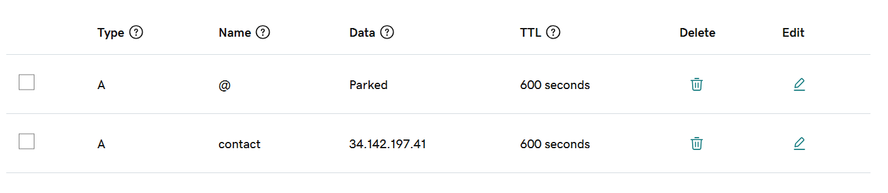
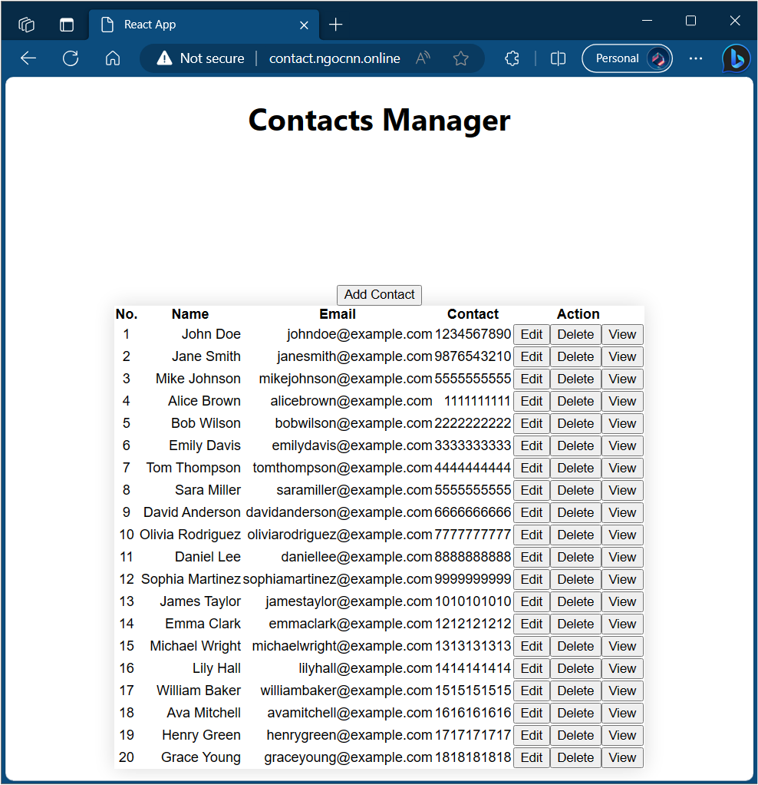

# Kubernetes Final Labs

## 1. Deploy HA MySQL Database using bitnami/mysql helm chart

### Add the Bitnami Helm repository

    helm repo add bitnami https://charts.bitnami.com/bitnami
    helm repo update

### Create helm values for MySQl StatefulSet

```yaml
# database-helm-values.yml

## architecture MySQL architecture
##
architecture: replication

## MySQL Authentication parameters
##
auth:
  ## Name for a custom database to create
  ##
  database: 'contacts'

## Dictionary of initdb scripts
## Specify dictionary of scripts to be run at first boot
## Create table Contacts in contacts database
##
initdbScripts:
  my_init_script.sql: |
    USE contacts;
    CREATE TABLE Contacts (
      id INT(11) NOT NULL AUTO_INCREMENT PRIMARY KEY,
      name VARCHAR(255) NOT NULL,
      email VARCHAR(255) NOT NULL,
      contact VARCHAR(255) NOT NULL
    );

## MySQL Secondary parameters for database replica
##
secondary:
  ## Number of MySQL secondary replicas
  ##
  replicaCount: 2
```

Create a release mysql-database release using the Bitnami MySQL Helm chart with custom values defined in `database-helm-values.yml`

    helm install mysql-database bitnami/mysql -f database-helm-values.yml

Results:

| NAME                           | READY | STATUS  | RESTARTS | AGE   |
| ------------------------------ | ----- | ------- | -------- | ----- |
| pod/mysql-database-primary-0   | 1/1   | Running | 0        | 8m43s |
| pod/mysql-database-secondary-0 | 1/1   | Running | 0        | 8m43s |
| pod/mysql-database-secondary-1 | 1/1   | Running | 0        | 4m47s |

| NAME                                      | TYPE      | CLUSTER-IP     | EXTERNAL-IP | PORT(S)  | AGE   |
| ----------------------------------------- | --------- | -------------- | ----------- | -------- | ----- |
| service/mysql-database-primary            | ClusterIP | 34.118.232.107 |             | 3306/TCP | 8m47s |
| service/mysql-database-primary-headless   | ClusterIP | None           |             | 3306/TCP | 8m47s |
| service/mysql-database-secondary          | ClusterIP | 34.118.238.82  |             | 3306/TCP | 8m47s |
| service/mysql-database-secondary-headless | ClusterIP | None           |             | 3306/TCP | 8m47s |

| NAME                                      | READY | AGE   |
| ----------------------------------------- | ----- | ----- |
| statefulset.apps/mysql-database-primary   | 1/1   | 8m47s |
| statefulset.apps/mysql-database-secondary | 2/2   | 8m47s |

Then we can connect backend to database using these services

- Primary (read/write): `mysql-database-primary.default.svc.cluster.local`
- Secondary (read-only): `mysql-database-secondary.default.svc.cluster.local`

## 2. Deploy backend servers

### Create backend-config

    kubectl apply -f backend-configmap.yml

```yaml
BACKEND_PORT: '5000'
DB_PORT: '3306'
APP_DATABASE: 'contacts'
DB_POOL_MAX: '20'
DB_POOL_IDLE: '30000'
PRIMARY_DB_HOST: 'mysql-database-primary.default.svc.cluster.local'
SECONDARY_DB_HOST: 'mysql-database-secondary.default.svc.cluster.local'
DB_USERNAME: 'root'
```

Declare ConfigMap `backend-config` and Secret `mysql-database` (created by bitnami/mysql helm chart) in backend-deployment

```yaml
envFrom:
  - configMapRef:
      name: backend-config
env:
  - name: DB_PASSWORD
    valueFrom:
      secretKeyRef:
        name: mysql-database
        key: mysql-root-password
```

### Create `backend-deployment`

    kubectl get deployment backend-deployment.yml

### Create `backend-cluster-ip`

    kubectl apply -f backend-service.yml

## 3. Deploy frontend servers

### Create `frontend-deployment`

    kubectl get deployment frontend-deployment.yml

### Create `frontend-cluster-ip`

    kubectl apply -f frontend-service.yml

## 4. Create ingress

### Add the Kubernetes ingress-nginx repo

    helm repo add ingress-nginx https://kubernetes.github.io/ingress-nginx
    helm repo update

### Deploy ingress-nginx and create DNS record

    helm install my-ingress-nginx ingress-nginx/ingress-nginx

| NAME                        | TYPE         | CLUSTER-IP    | EXTERNAL-IP   | PORT(S)                    | AGE   |
| --------------------------- | ------------ | ------------- | ------------- | -------------------------- | ----- |
| my-ingress-nginx-controller | LoadBalancer | 34.118.228.85 | 34.142.197.41 | 80:31722/TCP,443:31268/TCP | 2m51s |

Service LoadBalancer `my-ingress-nginx-controller` has external ip `34.142.197.41`

My domain name `ngocnn.online` and DNS record



### Create ingress rules

    kubectl apply -f nginx-ingress.yml

```yaml
rules:
  - host: contact.ngocnn.online
    http:
      paths:
        - pathType: Prefix
          backend:
            service:
              name: frontend-cluster-ip
              port:
                number: 80
          path: /
  - host: contact.ngocnn.online
    http:
      paths:
        - pathType: Prefix
          backend:
            service:
              name: backend-cluster-ip
              port:
                number: 5000
          path: /api
```


